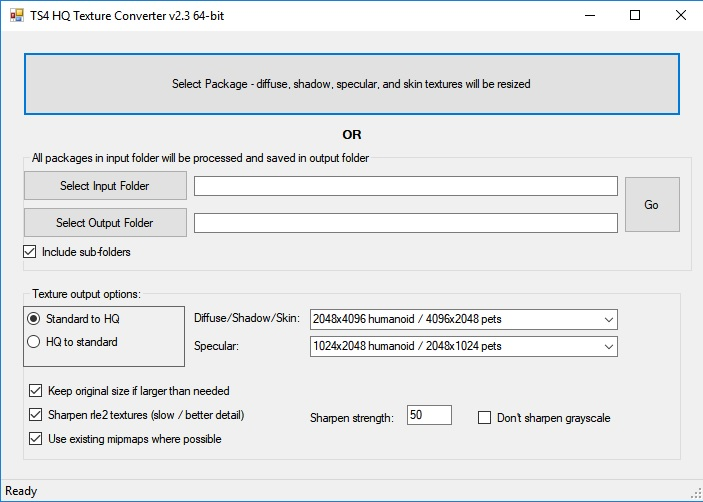
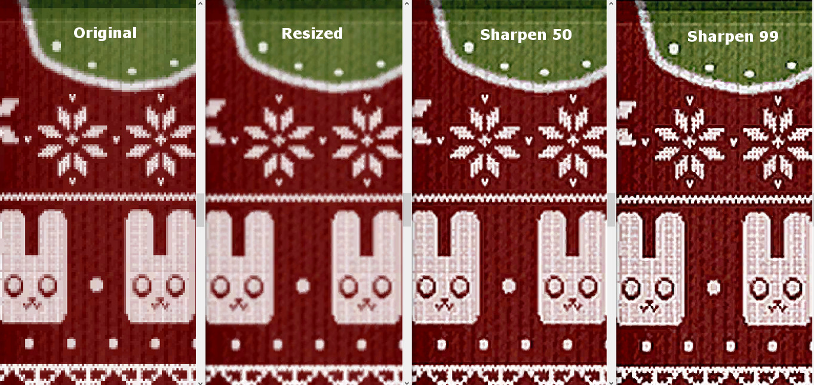
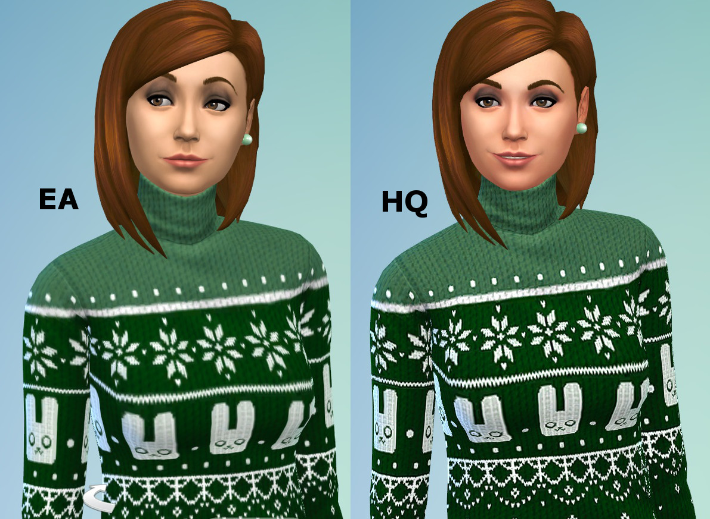

# HQ Texture Converter - version 2.7.0.0 - updated 2/14/2023

* This is a fork from MTS. 
* Original description by [CmarNYC](https://modthesims.info/member.php?u=3216596) who retired on earth and is now supporting the TS4 development in heaven.

## Description

Converting a pile of CC to be compatible with the HQ Mod can be quite a chore. This tool does it for you.

What it does:

You can select either one package or input and output folders. If you select one package, it will be converted and you'll be prompted to save it with a new name. If you select folders, all packages in the input folder will be converted and saved in the output folder with new names. A status line at the bottom of the window will let you know what it's doing.

Conversion:
* RLE2 textures (diffuse, shadow, skin color, and skin definition) are resized to 2048x4096
* LRLE textures (diffuse and skin color) are resized to 2048x4096
* RLE2 textures disguised as LRLE are converted and resized to true LRLE 2048x4096
* RLES textures (specular) are resized to 1024x2048
* DDS CAS skin color files are resized to 2048x4096

However, these are just the defaults and you can select the output dimensions for yourself. Will also convert from HQ dimensions to standard if needed.

Pet textures are automatically resized correctly.

Requires Windows and .NET 4.7. If you're on Windows 10 you probably already have it; if you're using Windows 7 or 8.1 you can install it if necessary. Requires 64-bit. (If anyone needs a 32-bit version I'll provide it, but it's likely you'll get memory errors when processing large packages.)

How to use:

Use the top button to select a package to process one at a time. Select input and output folders to process every package in the folder. As of version 2.3 it will also optionally convert subfolders in the input folder, creating corresponding subfolders in the output folder if necessary.

Texture output options:

* Choice of which conversion to do and the target texture dimensions should be self-explanatory.
* Keep original size - when converting to HQ, you can choose to keep any textures that are larger than needed as is.
* Sharpen rle2 and lrle textures - using this option will sharpen the main (diffuse) textures of clothing, hair, accessories, skins, etc. You can choose the sharpening strength. Sharpening will slow down processing significantly. Strength of sharpening makes no difference in speed. Sharpening may or may not be useful when working with LRLE textures, you'll have to experiment.
* Don't sharpen grayscale - starting in version 2.2 the tool uses the CASP in CC packages to identify the shadow textures, so this option should normally be left unchecked. It may be useful if converting packages that contain clothing/hair/accessory textures but no CASPs as when converting EA game packages. It may not. If checked, the tool will attempt to identify shadow textures and not sharpen them. The benefit is that sharpening may cause banding in some shadows which might be visible. The drawback is that any black and white or gray clothing and skin details may not be sharpened.
* Use existing mipmaps - starting in version 2.2, if this option is checked the tool will keep existing mipmaps if possible. Leaving this option checked will be slightly faster and retain the quality of original textures in the mipmaps. In cases where sharpening has made a big improvement in a texture you may want to try unchecking it and generating new mipmaps. 

With sharpening enabled, conversion will be slow. A package of 1000 rle2 and/or lrle textures could take around 2 hours or more. Without sharpening it's significantly faster. The program will prevent your computer from sleeping during conversion, but your monitor will still time out and sleep and you may see the monitor blacking out for a couple of seconds at a time even while you're using it.

Sharpening comparison:

#### Notes/Warnings:

The tool should only be run on packages that include only CAS parts (clothing, hair, accessories, makeup, skins, etc.). Running it on packages containing other CC such as objects may result in textures of the wrong size and/or wrong format and could cause your game to crash or not start.

This should go without saying, but you should keep your original packages in case something goes wrong.

Please report problems, questions, and reasonable requests in the comments.

Windows only, sorry. If anyone wants to convert it for Mac, you have my permission.

### Screenshots

### Updates:
#### V2.7.0.1, 2024-01-24:
- No new features
- Code imported into with VS 2022
- 64 bit build
- Code shared to keep it alive.
- I'm not a C# developer, please fork this repository to create new versions. 

#### Version 2.7
Belatedly updated to use the new compression format for LRLE.

#### Version 2.6.1
Fix for errors thrown by empty CASPs in EA packages.

#### Version 2.6
Update for yet another new version of CASP.
Will no longer sharpen when sizing from HQ to non-HQ.

#### Version 2.5:
Update for another new version of CASP.
Added support for LRLE textures. This needs more testing; please report problems.

#### Version 2.4:
Update for the new version of the CASP.
I'm doing only a 64-bit version this time. If anyone needs a 32-bit version I'll provide it, but I doubt there's much if any need.

#### Version 2.3:
Fixes: Corrects an error affecting memory that was causing random crashes with no error message or an access violation.

New features:

    During batch conversion, optionally convert subfolders of packages under the input folder. Subfolders with the same names will be created in the output folder if they don't already exist.
    If any packages fail to convert during batch conversion due to unreadable textures or whatever, the tool will continue to run and display a list of packages that could not be converted when it's finished.

Many thanks to claudiasharon for working with me about the crashing problem.

#### Version 2.2:

Fixes: Fixes shadow lines again appearing when converting CC on some systems.

New features: Optionally use existing mipmaps.

Many thanks to LunaLechuza for helpful suggestions and testing.

#### Version 2.0:

Fixes: Corrected the lines on shadow textures and the dark lines around the edges of some diffuse textures.

New features: 64-bit version, sharpening, keeping larger-than-needed textures is now optional.

Additional Credits:

With thanks to Iconic for requesting this tool!

The HQ Mod is here: http://alf-si.tumblr.com/HQ_ts4_English

Image and package handling done with the s4pi library: https://github.com/s4ptacle/Sims4Tools/tree/develop

Folder selection uses Ookii.Dialogs: http://www.ookii.org/software/dialogs/